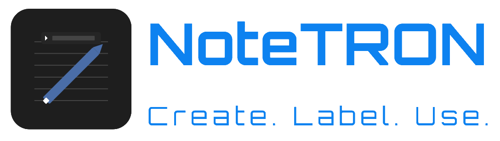
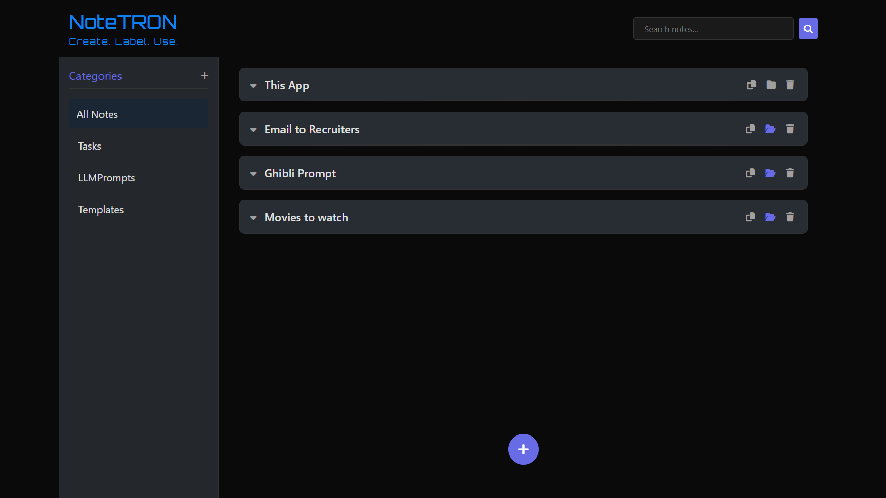
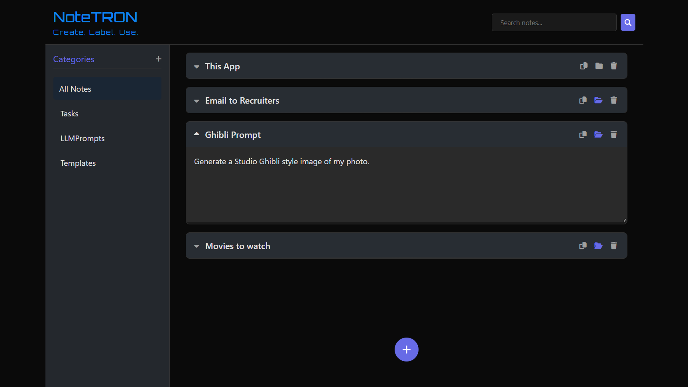

<div style="text-align: center;">
    
</div>

---

<p align="center">
  A lightweight, elegant desktop notes application.
</p>

<p align="center">
  
</p>

## 🚀 Features

- **Sleek TRON-Inspired UI**: Dark theme with neon blue, purple, and orange accents
- **Full CRUD Operations**: Create, read, update, and delete notes with ease
- **Smart Search**: Search through both note titles and content
- **Collapsible Notes**: Expandable/collapsible note sections for better organization
- **Auto-Saving**: Notes are automatically saved as you type and when closing the app
- **Copy Button**: Easily copy entire note contents to clipboard
- **Responsive Design**: Works on various screen sizes
- **Cross-Platform**: Available for Windows, macOS, and Linux

## 🔧 Technologies

- [Electron](https://www.electronjs.org/) - Cross-platform desktop apps with JavaScript, HTML, and CSS
- JavaScript (ES6+)
- HTML5 & CSS3
- Font Awesome - For icons

## 📦 Installation

### Pre-built Binaries

Download the latest version for your operating system from the [Releases](https://AkashKK25.github.io/NoteTRON#Download) page.

### Build from Source

```bash
# Clone the repository
git clone https://github.com/AkashKK25/notetron-app.git

# Navigate to the project directory
cd notetron

# Install dependencies
npm install

# Start the application
npm start
```

## 🏗️ Building for Distribution

```bash
# For all platforms
npm run build

# For specific platforms
npm run build:win   # Windows
npm run build:mac   # macOS
npm run build:linux # Linux
```

The built application will be available in the `dist` folder.

## 🖥️ Usage

1. **Creating a Note**: Click the '+' button in the center
2. **Editing a Note**: Click on the title or content to edit
3. **Expanding/Collapsing a Note**: Click on the note header
4. **Searching Notes**: Type in the search box at the top
5. **Copying Note Content**: Click the copy icon on any note
6. **Deleting a Note**: Click the trash icon on any note

## 🛠️ Project Structure

```
notetron/
├── assets/             # Build resources
│   └── icons/          # Application icons for different platforms
├── index.html          # Main application HTML
├── main.js             # Electron main process
├── preload.js          # Preload script for secure IPC
├── renderer.js         # Renderer process (UI logic)
├── styles.css          # Application styling
└── package.json        # Project configuration
```

## 🤝 Contributing

Contributions are welcome! Please feel free to submit a Pull Request.

1. Fork the project
2. Create your feature branch (`git checkout -b feature/new-feature-fix`)
3. Commit your changes (`git commit -m 'Add a feature or a bug fix'`)
4. Push to the branch (`git push origin feature/new-feature-fix`)
5. Open a Pull Request

## ✨ Creating Custom Icons

If you'd like to create your own custom icons for NoteTRON:

1. Create icons in the following formats:
   - Windows: `icon.ico` (256x256)
   - macOS: `icon.icns`
   - Linux: `icon.png` (512x512)
   
2. Place them in the `assets/` directory

## 📸 Screenshots

<p align="center">
  
  
</p>

## 🙏 Acknowledgements

- [TRON: Legacy](https://www.imdb.com/title/tt1104001/) for the visual inspiration
- [Electron](https://www.electronjs.org/) team for the amazing framework
- [Font Awesome](https://fontawesome.com/) for the icons

## Author
[Akash Kumar Kondaparthi]()